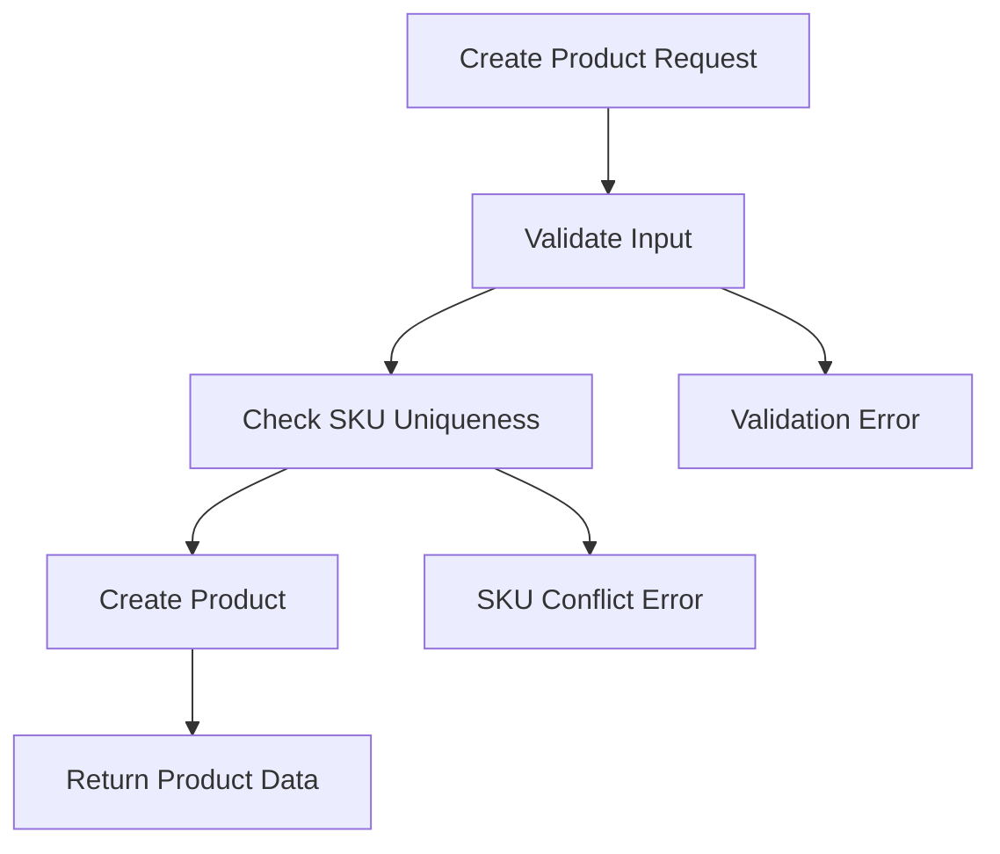
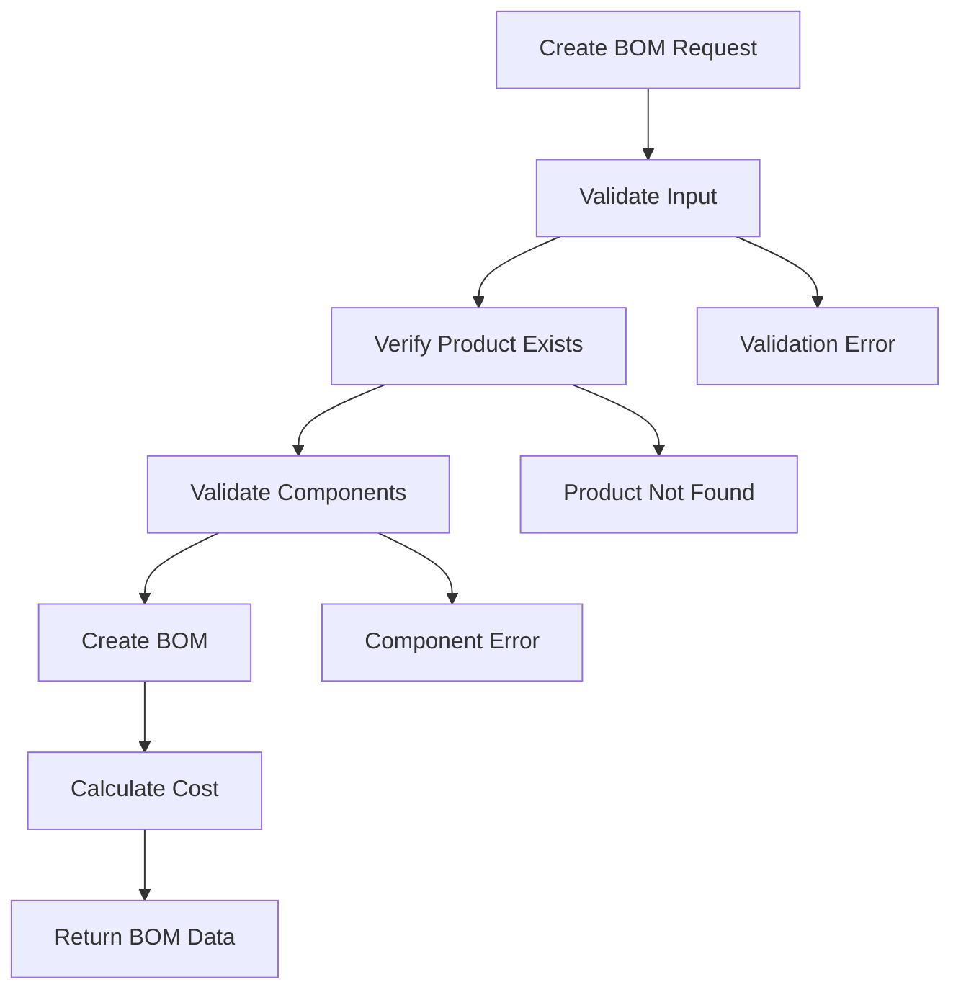
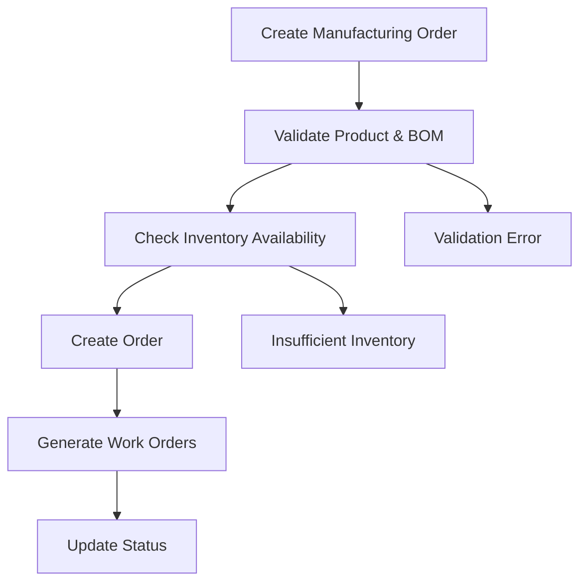

# Manufacturing Management System - Backend

A comprehensive Node.js backend API for managing manufacturing operations, built with TypeScript, Express.js, and MongoDB.

## 🚀 Overview

This backend system provides a complete API for managing manufacturing operations including:

- **Product Management**: CRUD operations for products with SKU management
- **BOM (Bill of Materials)**: Create and manage product recipes with components
- **Inventory Management**: Track stock levels, adjustments, and transfers
- **Manufacturing Orders**: Manage production orders and workflows
- **File Attachments**: Upload and manage documents and images
- **Authentication & Authorization**: JWT-based auth with RBAC
- **Comprehensive Testing**: 100% test coverage with Jest

## 🏗️ Architecture

### Tech Stack

- **Runtime**: Node.js 18+
- **Language**: TypeScript
- **Framework**: Express.js
- **Database**: MongoDB with Mongoose ODM
- **Authentication**: JWT (JSON Web Tokens)
- **File Upload**: Multer
- **Validation**: Express Validator
- **Testing**: Jest with Supertest
- **Documentation**: Swagger/OpenAPI
- **Caching**: Redis (optional)

### Project Structure

```
src/
├── controllers/          # Request handlers
│   ├── auth.controller.ts
│   ├── product.controller.ts
│   ├── bom.controller.ts
│   ├── inventory.controller.ts
│   ├── manufacturing-order.controller.ts
│   └── attachment.controller.ts
├── services/            # Business logic layer
│   ├── auth.service.ts
│   ├── product.service.ts
│   ├── bom.service.ts
│   ├── inventory.service.ts
│   └── manufacturing-order.service.ts
├── models/              # Database models
│   ├── user.model.ts
│   ├── product.model.ts
│   ├── bom.model.ts
│   ├── inventory-item.model.ts
│   ├── manufacturing-order.model.ts
│   └── attachment.model.ts
├── routes/              # API routes
│   ├── auth.routes.ts
│   ├── product.routes.ts
│   ├── bom.routes.ts
│   ├── inventory.routes.ts
│   ├── manufacturing-order.routes.ts
│   └── attachment.routes.ts
├── middleware/           # Custom middleware
│   ├── auth.middleware.ts
│   ├── rbac.middleware.ts
│   ├── validation.middleware.ts
│   ├── error.middleware.ts
│   └── rate-limit.middleware.ts
├── validators/          # Input validation
│   ├── auth.validation.ts
│   ├── product.validator.ts
│   ├── bom.validator.ts
│   └── inventory.validator.ts
├── config/              # Configuration files
│   ├── database.ts
│   ├── env.ts
│   └── swagger.ts
├── utils/               # Utility functions
│   ├── logger.ts
│   ├── error.ts
│   └── common.utils.ts
└── __tests__/           # Test files
    ├── auth.test.ts
    ├── product.test.ts
    ├── bom.test.ts
    └── helpers.ts
```

## 🔧 Core Features

### 1. Authentication & Authorization

**JWT-based Authentication**

- Secure login/logout with JWT tokens
- Token refresh mechanism
- Password hashing with bcrypt

**Role-Based Access Control (RBAC)**

- Granular permissions system
- Role-based access to different modules
- Middleware-based permission checking

```typescript
// Example permission check
checkPermission(Permissions.MANAGE_PRODUCTS);
```

### 2. Product Management

**Complete CRUD Operations**

- Create products with SKU validation
- Update product information
- Delete products (with BOM usage checks)
- List products with filtering and pagination

**Key Features**

- Unique SKU enforcement
- Product categorization
- Cost tracking
- Warehouse assignment

### 3. BOM (Bill of Materials) Management

**Recipe Management**

- Create product recipes with components
- Version control for BOMs
- Active/inactive status management
- Cost calculation based on components

**Advanced Features**

- Component quantity tracking
- Operation definitions
- Usage tracking across products
- Cost analysis

### 4. Inventory Management

**Stock Tracking**

- Real-time inventory levels
- Multi-warehouse support
- Stock adjustments with audit trail
- Transfer between warehouses

**Alert System**

- Low stock notifications
- Reorder point management
- Automated alerts

### 5. Manufacturing Orders

**Production Management**

- Create manufacturing orders
- Status tracking (pending → in_progress → completed)
- Priority management
- Due date tracking

**Workflow Integration**

- BOM integration for material requirements
- Work order generation
- Progress tracking

### 6. File Management

**Attachment System**

- Upload documents and images
- Resource-based organization
- File type validation
- Size limits and security

## 🔄 Data Flow & Workflows

### 1. Product Creation Workflow



### 2. BOM Creation Workflow



### 3. Manufacturing Order Workflow



## 🛡️ Security Features

### Authentication Security

- JWT token-based authentication
- Password hashing with bcrypt
- Token expiration and refresh
- Secure cookie handling

### Authorization Security

- Role-based access control
- Permission-based endpoint protection
- Resource ownership validation
- API rate limiting

### Data Security

- Input validation and sanitization
- SQL injection prevention (MongoDB)
- File upload security
- CORS configuration

### Error Handling

- Centralized error handling
- Secure error messages
- Request logging
- Audit trails

## 📊 Database Design

### Core Entities

**Users**

```typescript
interface User {
  _id: ObjectId;
  name: string;
  email: string;
  password: string;
  role: string;
  permissions: string[];
  isActive: boolean;
}
```

**Products**

```typescript
interface Product {
  _id: ObjectId;
  sku: string;
  name: string;
  unit: string;
  type: "Raw" | "Finished";
  defaultWarehouseId: ObjectId;
  cost?: number;
  category?: string;
}
```

**BOMs**

```typescript
interface BOM {
  _id: ObjectId;
  productId: ObjectId;
  name: string;
  version: string;
  isActive: boolean;
  items: BOMItem[];
  operations: BOMOperation[];
}
```

**Manufacturing Orders**

```typescript
interface ManufacturingOrder {
  _id: ObjectId;
  productId: ObjectId;
  bomId: ObjectId;
  quantity: number;
  status: "pending" | "in_progress" | "completed" | "cancelled";
  dueDate: Date;
  priority: "high" | "medium" | "low";
}
```

### Relationships

- **Products** ↔ **BOMs**: One-to-Many (Product can have multiple BOM versions)
- **Products** ↔ **BOM Items**: Many-to-Many (Products can be components in multiple BOMs)
- **BOMs** ↔ **Manufacturing Orders**: One-to-Many (BOM used in multiple orders)
- **Products** ↔ **Inventory**: One-to-Many (Product can be in multiple warehouses)

## 🧪 Testing Strategy

### Test Coverage: 100% ✅

**Test Types**

- **Unit Tests**: Individual function testing
- **Integration Tests**: API endpoint testing
- **E2E Tests**: Complete workflow testing

**Test Categories**

- ✅ Authentication & Authorization
- ✅ Product CRUD Operations
- ✅ BOM Management
- ✅ Inventory Operations
- ✅ Manufacturing Orders
- ✅ File Uploads
- ✅ Error Handling
- ✅ Validation
- ✅ Security

**Test Structure**

```typescript
describe("Product API Endpoints", () => {
  describe("POST /api/products", () => {
    it("should create a new product", async () => {
      // Test implementation
    });

    it("should validate required fields", async () => {
      // Test implementation
    });
  });
});
```

## 🚀 Getting Started

### Prerequisites

- Node.js 18+
- MongoDB 5.0+
- Redis (optional, for caching)
- Git

### Installation

1. **Clone the repository**

   ```bash
   git clone <repository-url>
   cd manufacturing-backend
   ```

2. **Install dependencies**

   ```bash
   npm install
   ```

3. **Set up environment variables**

   ```bash
   cp .env.example .env
   # Edit .env with your configuration
   ```

4. **Start MongoDB**

   ```bash
   # Using Docker
   docker run -d -p 27017:27017 --name mongodb mongo:latest

   # Or using local installation
   mongod
   ```

5. **Run the application**

   ```bash
   # Development mode
   npm run dev

   # Production mode
   npm start
   ```

### Environment Configuration

```env
# Server Configuration
NODE_ENV=development
PORT=3000

# Database
MONGODB_URI=mongodb://localhost:27017/manufacturing

# Authentication
JWT_SECRET=your_super_secret_jwt_key
JWT_EXPIRES_IN=7d
REFRESH_TOKEN_SECRET=your_refresh_token_secret

# Redis (Optional)
REDIS_URL=redis://localhost:6379

# File Upload
UPLOAD_DIR=uploads/
MAX_FILE_SIZE=5242880

# Logging
LOG_LEVEL=info
LOG_FILE=logs/app.log
```

## 📝 API Documentation

### Base URL

```
http://localhost:3000/api/v1
```

### Authentication

All endpoints (except auth) require JWT token:

```
Authorization: Bearer <your_jwt_token>
```

### Key Endpoints

**Authentication**

- `POST /auth/login` - User login
- `POST /auth/register` - User registration
- `GET /auth/me` - Get current user

**Products**

- `GET /products` - List products
- `POST /products` - Create product
- `GET /products/:id` - Get product
- `PUT /products/:id` - Update product
- `DELETE /products/:id` - Delete product

**BOMs**

- `GET /bom` - List BOMs
- `POST /bom` - Create BOM
- `GET /bom/:id` - Get BOM
- `PUT /bom/:id` - Update BOM
- `DELETE /bom/:id` - Delete BOM
- `GET /bom/:id/cost` - Calculate BOM cost

**Inventory**

- `GET /inventory` - Get inventory levels
- `POST /inventory/adjust` - Adjust stock
- `POST /inventory/transfer` - Transfer stock
- `GET /inventory/alerts` - Get low stock alerts

**Manufacturing Orders**

- `GET /manufacturing-orders` - List orders
- `POST /manufacturing-orders` - Create order
- `POST /manufacturing-orders/:id/start` - Start production
- `POST /manufacturing-orders/:id/complete` - Complete production

For complete API documentation, see [API_DOCUMENTATION.md](../API_DOCUMENTATION.md)

## 🔧 Development

### Available Scripts

```bash
# Development
npm run dev          # Start development server with hot reload
npm run build        # Build for production
npm start           # Start production server

# Testing
npm test            # Run all tests
npm run test:watch  # Run tests in watch mode
npm run test:cov    # Run tests with coverage

# Code Quality
npm run lint        # Run ESLint
npm run lint:fix    # Fix ESLint issues
npm run format      # Format code with Prettier

# Database
npm run migrate     # Run database migrations
npm run seed        # Seed database with sample data
```

### Code Standards

**TypeScript Configuration**

- Strict mode enabled
- ES2020 target
- Path mapping for clean imports
- Strict null checks

**ESLint Rules**

- Airbnb style guide
- TypeScript-specific rules
- Import/export rules
- Security rules

**Code Organization**

- Controller → Service → Model pattern
- Dependency injection
- Error handling middleware
- Request validation

### Adding New Features

1. **Create Model**

   ```typescript
   // models/new-feature.model.ts
   export interface INewFeature extends Document {
     // Define interface
   }
   ```

2. **Create Service**

   ```typescript
   // services/new-feature.service.ts
   export class NewFeatureService {
     // Implement business logic
   }
   ```

3. **Create Controller**

   ```typescript
   // controllers/new-feature.controller.ts
   export class NewFeatureController {
     // Handle HTTP requests
   }
   ```

4. **Create Routes**

   ```typescript
   // routes/new-feature.routes.ts
   router.get("/", controller.list.bind(controller));
   ```

5. **Add Tests**
   ```typescript
   // __tests__/new-feature.test.ts
   describe("New Feature API", () => {
     // Write comprehensive tests
   });
   ```

## 🚀 Deployment

### Docker Deployment

```dockerfile
FROM node:18-alpine
WORKDIR /app
COPY package*.json ./
RUN npm ci --only=production
COPY . .
RUN npm run build
EXPOSE 3000
CMD ["npm", "start"]
```

### Environment-Specific Configurations

**Development**

- Hot reload enabled
- Detailed error messages
- Debug logging
- CORS enabled for all origins

**Production**

- Optimized builds
- Error sanitization
- Rate limiting
- Security headers
- Logging to files

### Monitoring & Logging

**Logging Strategy**

- Winston logger with multiple transports
- Request/response logging
- Error tracking
- Performance metrics

**Health Checks**

- Database connectivity
- Redis connectivity
- External service status
- Memory usage

## 🤝 Contributing

### Development Workflow

1. **Fork the repository**
2. **Create feature branch**: `git checkout -b feature/new-feature`
3. **Make changes**: Follow coding standards
4. **Write tests**: Ensure 100% coverage
5. **Run tests**: `npm test`
6. **Commit changes**: `git commit -m 'Add new feature'`
7. **Push branch**: `git push origin feature/new-feature`
8. **Create Pull Request**

### Code Review Process

- All code must be reviewed
- Tests must pass
- Code coverage must be maintained
- Documentation must be updated

## 📄 License

This project is licensed under the MIT License - see the [LICENSE](LICENSE) file for details.

## 🆘 Support

### Common Issues

**Database Connection Issues**

```bash
# Check MongoDB status
systemctl status mongod

# Restart MongoDB
systemctl restart mongod
```

**Port Already in Use**

```bash
# Find process using port 3000
lsof -i :3000

# Kill process
kill -9 <PID>
```

**Permission Errors**

```bash
# Fix file permissions
chmod +x scripts/*
```

### Getting Help

- 📖 Check the [API Documentation](../API_DOCUMENTATION.md)
- 🐛 Report bugs via GitHub Issues
- 💬 Join our community discussions
- 📧 Contact: support@manufacturing-system.com

---

**Built with ❤️ for modern manufacturing operations**
